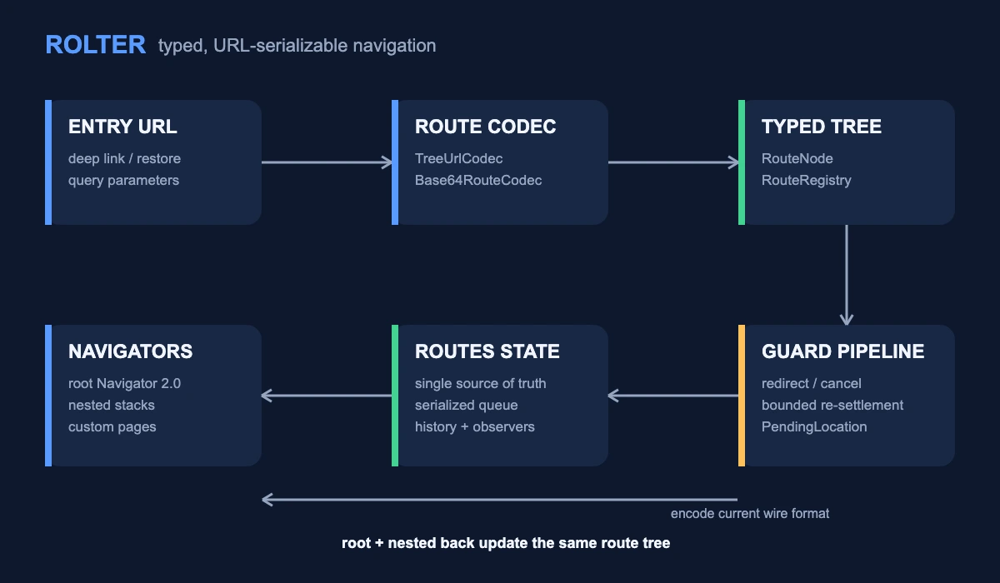
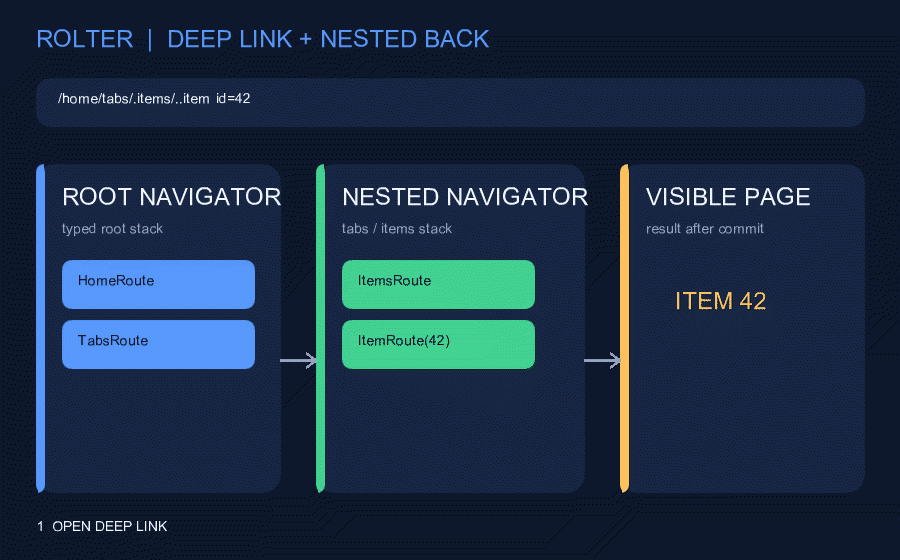

# Rolter

A hand-rolled, declarative Navigator 2.0 routing engine for Flutter with a
typed, URL-serializable route tree and built-in nested navigation.

## Features

- Declarative, tree-based route configuration
- Typed routes with URL serialization/deserialization
- Built-in support for nested navigation
- Built directly on top of Navigator 2.0 (`Router`, `RouterDelegate`,
  `RouteInformationParser`)

## Status

This package is in early development. The API is not yet stable and may
change significantly between versions.

Rolter requires Flutter 3.32 or later and Dart 3.8 or later. Development and
canonical formatting use the latest stable SDK, while CI verifies the declared
minimum and the latest stable release.

## Architecture



The URL codec reconstructs typed route nodes, guards settle the requested
tree, and `RoutesState` commits a single source of truth rendered by root and
nested navigators.



The animation opens a deep link into a nested stack, then removes the nested
detail before returning through the root stack.

## Getting started

Add `rolter` to your `pubspec.yaml`:

```yaml
dependencies:
  rolter: ^0.1.0
```

## Usage

```dart
import 'package:flutter/material.dart';
import 'package:rolter/rolter.dart';

// 1. Define a typed route tree.
sealed class AppRoute implements RouteNode {
  const AppRoute();
  @override
  List<AppRoute> get children => const [];
  @override
  AppRoute withChildren(List<RouteNode> children) => this;
}

final class HomeRoute extends AppRoute {
  const HomeRoute();
  @override
  LocalKey get pageKey => const ValueKey('home');
  @override
  String get name => 'home';
  @override
  Map<String, String> toParams() => const {};
  @override
  Page<Object?> buildPage(BuildContext context) =>
      const MaterialPage(child: Scaffold(body: Center(child: Text('Home'))));
}

// 2. Register decoders so URLs / deep links rebuild the tree.
final registry = RouteRegistry<AppRoute>(
  {'home': (params, children) => const HomeRoute()},
  fallback: (uri) => const HomeRoute(),
);

// 3. Wire Navigator 2.0.
final state = RoutesState<AppRoute>(const [HomeRoute()], (stack) => stack);

final app = MaterialApp.router(
  routerDelegate: RoutingDelegate<AppRoute>(state),
  routeInformationParser:
      RoutingInformationParser<AppRoute>(TreeUrlCodec(registry)),
);
```

To call navigation from screens via `context.navigator`, place a
`NavigatorScope` (with your `NavigationController`) **above**
`MaterialApp.router` — see the [`example/`](example/) app. The snippet above
renders and deep-links without it.

See the [`example/`](example/) app for nested navigation, tabs, route guards,
push-for-result, dialog-as-route, and per-route dependency scopes.

Import only `package:rolter/rolter.dart`. Anything under
`package:rolter/src/` is implementation detail and may change in any release.

## Extensible navigation scheduling and security

`NavigationQueue` is a public, fail-fast FIFO primitive for custom navigation
architectures. It copies submitted snapshots, serializes asynchronous
processors, and never silently drops or coalesces requests. Requests queued
behind a failed processor are discarded, and a fresh request is accepted after
the failure has been observed through `processingCompleted`.

The queue intentionally has no built-in capacity or overflow policy. If an
application can generate navigation faster than its processor can settle it,
debounce or rate-limit that event source before adding snapshots.

`RoutesState` deliberately does not expose its mutable internal queue. Use its
navigation methods and the read-only `isProcessing` and `processingCompleted`
properties so every request passes through the configured `ApplyPipeline`.

A custom `SnapshotProcessor` is trusted application code and can choose not to
run route guards. Neither it nor `RouteGuard` is a security boundary: modified
clients can bypass client-side navigation policy. Always enforce authorization
again on the server before returning protected data or performing a protected
operation.

## Route identity (important)

Every `RouteNode` must have value `==`/`hashCode`, and its `pageKey` must encode
every identity-bearing param and be **unique across the whole tree**. The engine
detects changes with `listEquals` and keys pages by `pageKey`, so a param left
out of both is invisible (the navigation is silently a no-op) and a shared
`pageKey` would collapse two pages into one. `RoutesState` therefore rejects a
duplicate key before commit. For a leaf, put the params in the key and mix in
`KeyedRouteEquality`:

```dart
final class ItemRoute with KeyedRouteEquality {
  const ItemRoute(this.id);
  final int id;
  @override
  LocalKey get pageKey => ValueKey('item:$id'); // every param in the key
  @override
  String get name => 'item';
  @override
  List<RouteNode> get children => const [];
  @override
  Map<String, String> toParams() => {'id': '$id'};
  @override
  RouteNode withChildren(List<RouteNode> children) => this;
  @override
  Page<Object?> buildPage(BuildContext context) => /* ... */;
}
```

A shell/tab node distinguished by its `children` or by a param not in `pageKey`
(e.g. the active tab) must override `==`/`hashCode` to compare that state.

**Serializable vs runtime params.** Typed route fields carry both kinds, so
there is no separate `arguments`/`extra` split: `toParams()` is the URL wire
format — the serializable identity that survives a deep link (their
`arguments`). A typed field you *don't* put in `toParams()` is runtime-only
(their `extra`): fine within a session, but a cold deep link can't reconstruct
it, so keep anything that must survive in `toParams()`.

## Confirm on leave (blocking back)

Route guards run *after* a page is removed (`onDidRemovePage`), so they can't
pre-empt a back gesture. Block leaving with Flutter's `PopScope` on the screen,
then pop explicitly once confirmed:

```dart
PopScope(
  canPop: !hasUnsavedChanges,
  onPopInvokedWithResult: (didPop, _) async {
    if (didPop) return;
    if (await confirmDiscard(context)) context.navigator.pop();
  },
  child: /* ... */,
);
```

A guard's `cancel` is the *programmatic* safety net — the engine re-syncs the
navigator to the tree when a guard reverts a removal — but per-screen
confirmation belongs in `PopScope`. See the example's "Confirm on leave" demo.

## Deep links & return-after-login

A deep link is just a guard input: the guard pipeline runs on every
`setNewRoutePath`, so a guard can inspect and redirect the incoming stack — no
separate deep-link subsystem. To divert the user (e.g. to a lock/login screen)
and return them afterwards, share a `PendingLocation` with the guard:

```dart
final _pending = PendingLocation<AppRoute>();

@override
GuardResult<AppRoute> call(history, requested, context) {
  if (locked && wantsProtected) {
    _pending.remember(requested);                 // stash the intended target
    return const GuardResult.proceed([LockRoute()]);
  }
  if (_pending.hasPending && onLockScreen) {
    return GuardResult.proceed(_pending.take()!); // restore it on unlock
  }
  return GuardResult.proceed(requested);
}
```

Wire the guard's `Listenable` to `RoutesState.reevaluate` so unlocking reruns
the pipeline and replays the remembered location. See the example's `LockGuard`.

## Guards backed by a Bloc / stream

A `RouteGuard` is a `Listenable` — the pipeline reruns the guards whenever one
fires. A `Bloc`/`Cubit` is a `Stream`, not a `Listenable`, so bridge it with
`StreamListenable` instead of mixing in a `ChangeNotifier`: compose one, delegate
`addListener`/`removeListener` to it, and read the bloc's current value
synchronously from its `state` inside `call`:

```dart
final class LockGuard implements RouteGuard<AppRoute> {
  LockGuard(this._bloc) {
    _refresh = StreamListenable(_bloc.stream); // fires the guard on each event
  }

  final LockBloc _bloc;                        // Bloc<LockEvent, LockState>
  late final StreamListenable _refresh;
  final _pending = PendingLocation<AppRoute>();

  @override
  void addListener(VoidCallback l) => _refresh.addListener(l);
  @override
  void removeListener(VoidCallback l) => _refresh.removeListener(l);

  @override
  GuardResult<AppRoute> call(history, requested, context) {
    if (_bloc.state.isLocked && wantsProtected) {  // read current state, sync
      _pending.remember(requested);
      return const GuardResult.proceed([LockRoute()]);
    }
    if (_pending.hasPending && onLockScreen) {
      return GuardResult.proceed(_pending.take()!);
    }
    return GuardResult.proceed(requested);
  }

  void dispose() => _refresh.dispose();
}
```

The stream only signals *when* to re-evaluate; the decision reads the bloc's
`state` directly, so the guard stays decoupled from how state is stored (the
same shape works for a `ValueNotifier`, an `rxdart` subject, etc.). Pass an
already-`distinct()` (or mapped) stream to avoid redundant reruns.

## Back / forward history

`NavigationHistory` records committed states (wire it as a `NavObserver`) and
replays them through a `restore` callback, giving browser-like back/forward for
in-app controls or non-web targets (on the web the browser already does this):

```dart
late final RoutesState<AppRoute> state;
final history = NavigationHistory<AppRoute>((stack) => state.setRoot(stack));
state = RoutesState<AppRoute>(initial, pipeline, observers: [history]);

// `history` is a ChangeNotifier, so a control can rebuild its enabled state:
IconButton(onPressed: history.canGoBack ? history.back : null, icon: ...);
IconButton(onPressed: history.canGoForward ? history.forward : null, icon: ...);
```

A *new* navigation drops the forward entries (browser semantics); only
`back`/`forward` move the cursor without recording.

## Swapping the URL grammar

The parser depends on the `RouteUrlCodec` interface, not a concrete codec.
`TreeUrlCodec` is the default dot-depth implementation. Rolter also ships
`Base64RouteCodec` — a compact base64url-JSON-in-path codec for redirects that
strip the fragment (OAuth / Telegram): the whole route survives as one token
(`/eyJuIjoiaG9tZSJ9`). Or write your own, as long as `decode(encode(tree))`
round-trips.

Base64url is reversible encoding, not encryption, integrity protection, or
authentication. Anyone can decode, modify, and re-encode the route token. Do
not put secrets, credentials, or personal data in URLs; validate decoded route
semantics and enforce protected data and operations on the server.

### URL compatibility policy

The built-in encoder always writes the current wire format. Before 1.0, a
breaking URL grammar change increments the minor version, and the decoder keeps
accepting the previous minor's format for at least one complete minor release
cycle. Security-critical fixes may shorten that window and will be called out
prominently in the changelog.

Deep links often outlive package constraints. If an application replaces a
built-in codec or changes its route names or serialized parameters, the
application owns the corresponding migration and backward-decoding policy.

## Feature sub-routers (namespace isolation)

A flat registry shares one route-name namespace. When features ship as separate
packages, mount each under its own sub-registry so their names are isolated —
two features can each define a `detail`:

```dart
final shopRegistry = RouteRegistry<AppRoute>(
  {'home': ..., 'detail': ...},   // names local to shop
  fallback: NotFoundRoute.new,
);

final appRegistry = composeFeatureRouters<AppRoute>(
  fallback: NotFoundRoute.new,
  decoders: {...homeRoutes},        // flat top-level routes still work
  features: [
    FeatureRouter(name: 'shop', mountDecoder: ..., registry: shopRegistry),
    FeatureRouter(name: 'blog', mountDecoder: ..., registry: blogRegistry),
  ],
);
// /shop/.detail and /blog/.detail resolve via their OWN registries.
```

Page keys stay **global** (the Navigator's requirement), so keep them unique
across the whole tree (e.g. prefix by feature) even though URL *names* are
isolated. See the example's "Feature sub-routers" demo.

## State restoration

The navigation tree is restored from `RouteInformation`, so it survives a web
reload / deep link **and** an OS-killed relaunch — just set `restorationScopeId`
on `MaterialApp.router`:

```dart
MaterialApp.router(
  restorationScopeId: 'app',
  routerDelegate: delegate,
  routeInformationParser: parser,
);
```

The delegate restores through the framework's default `setRestoredRoutePath`
(which funnels into the same `setNewRoutePath`), so no extra engine wiring is
needed. Per-screen *ephemeral* state (scroll offset, a half-typed field) is the
screen's own concern — use Flutter's `RestorationMixin` inside the screen (or a
`RouteScope` value), independent of the router.

## Web URL strategy

rolter is URL-strategy-agnostic — pick one in your app's `main()`:

- **Hash** (Flutter web default — `/#/hub/home~intent=stream`): no server
  config, and the route lives in the fragment, immune to path normalization;
  but not SEO-friendly.
- **Path** (`usePathUrlStrategy()` — `/hub/home~intent=stream`): clean,
  shareable, SEO-friendly URLs, but the server must rewrite unknown paths to
  `index.html`. One caveat: the dot-depth grammar puts leading-dot segments
  (`.settings`) and `~` in the real path, so a proxy/CDN that normalizes
  RFC-3986 dot-segments could rewrite them — test your hosting, or use the hash
  strategy / `Base64RouteCodec` if that bites.

## Custom pages & transitions

A route's `buildPage` may return **any** `Page` — the engine never downcasts to
a concrete page type, so flat, nested, dialog, and custom-transition routes all
share one code path. Pick by how much you need:

| Need | Return | Custom `Route`? |
|---|---|---|
| A bespoke transition (fade/slide/scale) | `TransitionPage(transitionsBuilder: …)` | no |
| Full route semantics (drag-to-dismiss, barrier, predictive back) | your own `PageRoute`/`ModalRoute` (like `NoAnimationPage`) | yes |
| No animation for a whole nested stack | a `TransitionDelegate` (e.g. `NoAnimationTransitionDelegate`) on the navigator | — |

**One invariant:** a custom `Page` whose `createRoute` builds its own `Route`
MUST pass `settings: this`. The delegate matches a removed page back to its node
by `pageKey` read from the route's `settings`; omit it and the node leaks from
the tree.

## Organising the catalog

`RouteRegistry` takes a plain decoder map, so the catalog can be assembled two
ways:

- **Monolithic** — one `sealed AppRoute` + one registry; you get an exhaustive
  `switch` over routes.
- **Feature-first** — each feature contributes a decoder map (non-sealed routes,
  so they can live in separate packages), merged into one registry, or mounted as
  isolated sub-routers via `composeFeatureRouters`.

See [`example/`](example/) for a worked feature-first layout.

## Additional information

Rolter validates duplicate page keys and URL-unsafe route names in every build
mode and rejects them before commit or encoding. `StrictHierarchy` remains an
opt-in debug diagnostic for mis-wired nesting; other debug assertions are also
programming diagnostics, not production input validation. Applications must
still validate external route data and authorize every security-sensitive
operation on the server.

- Source code: https://github.com/ntfnd404/rolter
- Issue tracker: https://github.com/ntfnd404/rolter/issues
- License: BSD-3-Clause
